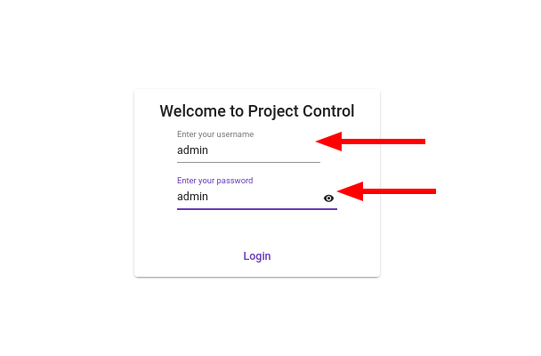
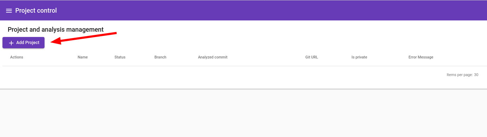
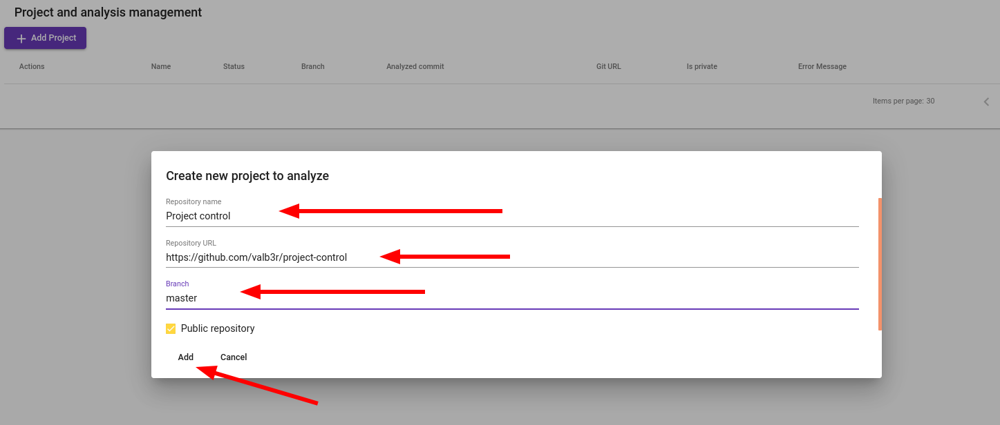

# What is this 

A tool to assess the effort spent to develop software project and its readiness.

# DEMO site credentials

Credentials: `admin/admin`

### Analyzes and graphically represents

1. Commit count per developer per week
1. Churn (lines changed) per developer per week
1. Owned code per developer per week
1. Rework code done by developers


# Building project

## Build (with tests)

```shell
./gradlew clean syncNpm build
```

## Build and run (without tests)

```shell
./gradlew clean syncNpm build -x test bootRun
```

## Build monolith JAR

```shell
./gradlew clean syncNpm -x test bootJar
```

## Build docker

```shell
./gradlew clean syncNpm syncJar buildImage
```

# Running project

0. Ensure you have Java 11 installed
1. Start Neo4j database i.e. using docker (ready to use sample deployment is in [docker-compose.yml](neo4j-docker-compose/docker-compose.yml))
2. Do [Build and run (without tests)](#build-and-run-without-tests) to start application
3. Open UI at [http://localhost:8080](http://localhost:8080)
4. Login with `admin/admin` credentials
   


5. Click on `Add Project Button` (Open `Projects` page from menu if necessary)
   



5. Fill in new project to analyze details, click `Add` button when done



6. Start project analysis - click `Restart analysis button`


7. Wait for analysis to be finished


8. Create new user from aliases - open `User mappings`


9. Create new user from aliases - Create new user


9. Create new user from aliases - merge aliases to user


10. See the reports


# Exclusion/Inclusion rule examples

## Inclusion:

```drools
package com.project_control.rules

import  com.valb3r.projectcontrol.domain.rules.RuleContext

dialect  "mvel"


rule "Only .java files"
    no-loop
    when
       $c: RuleContext(path matches '.+\\.java')
    then
       $c.include = true;
       update($c)
end
```

## Exclusion:

```drools
package com.project_control.rules

import  com.valb3r.projectcontrol.domain.rules.RuleContext

dialect  "mvel"


rule "Not in resources files"
    no-loop
    when
       $c: RuleContext(path matches '.+/resources/.+')
    then
       $c.exclude = true;
       update($c)
end
```
